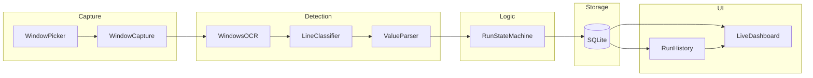
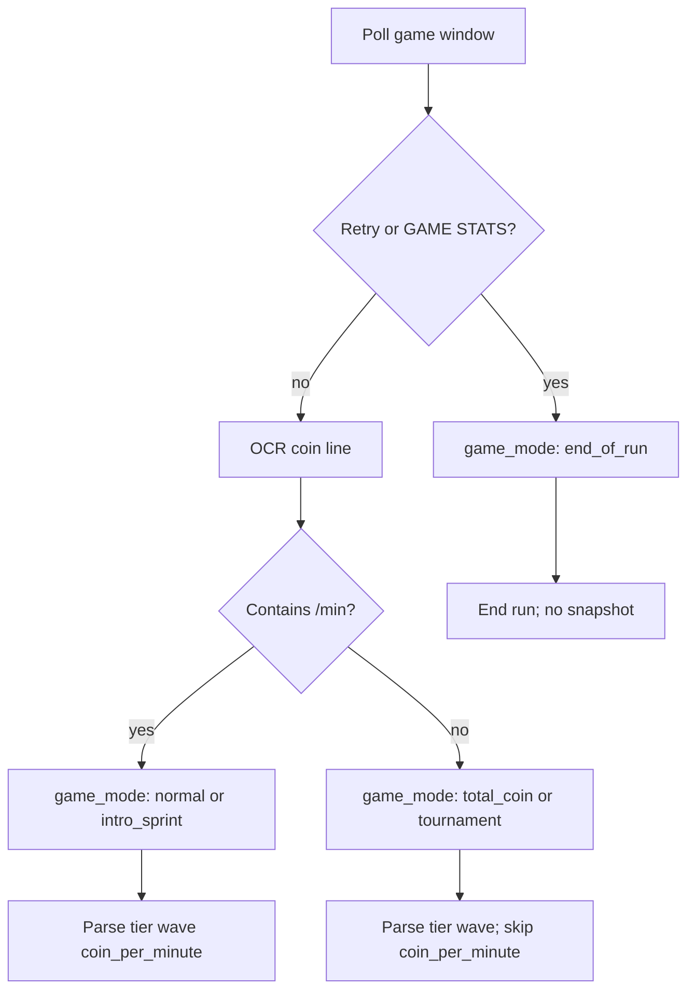

# WaveTrace

**Repository:** https://github.com/sbrants/wavetrace  
**Releases:** https://github.com/sbrants/wavetrace/releases

## Overview

**WaveTrace** is an automatic per-wave tracker for the idle game **The Tower**. The app captures screenshots of the game, uses OCR to read Tier, Coin/Minute, and Wave, and records snapshots to a local database whenever the wave increments. A web-based UI displays live stats, charts, and run history.

**Current status (v0.2.25):** Phase 1 is **shipped on Windows 10+** via GitHub Releases and the **Microsoft Store**. **macOS 10.15+** (Apple Silicon + Intel DMGs + in-app updater) shipped in v0.2.9/v0.2.11. Linux builds (AppImage + Arch binary) and GitHub in-app auto-update are also shipped. **Wave skip** detection, charting, and resume catch-up shipped in v0.2.22–v0.2.23; **skip/coin analytics**, Intro Sprint fixes, dev branding, and **accessibility (phases A–B)** in v0.2.24; **wave jump** display and chart UX in v0.2.25. See [Phases](#phases) and [Distribution](#distribution).

**Platform rollout is phased** — see [Phases](#phases) and the platform matrix below. Phase 1 targets **Windows desktop first**; Linux followed in v0.1.x.

### Platform matrix


| Phase | Platforms             | Capture target                                               | Status |
| ----- | --------------------- | ------------------------------------------------------------ | ------ |
| 1     | Windows 10+           | Emulator or game window                                      | **Shipped** (v0.1.0+) |
| 1b    | Linux                 | Same as Phase 1 (Tesseract OCR)                              | **Shipped** (v0.1.2+) |
| 1b    | macOS                 | Same as Phase 1 (Tesseract OCR)                              | **Shipped** (v0.2.9+) |
| 2     | All Phase 1 platforms | Background capture (stretch); date-range filters **done**    | Partial |
| 3+    | Android, iOS          | Direct app capture (separate implementation)                 | Future |

### Distribution


| Channel | Windows artifact | Updates | Status (v0.2.24) |
| ------- | ---------------- | ------- | ----------------- |
| GitHub Releases | NSIS `.exe`, MSI | In-app updater (`latest.json`) | **Shipped** |
| Microsoft Store | MSIX (`runFullTrust`) | Microsoft Store | **Shipped** |
| macOS (GitHub) | `.dmg` (arm64 + x86_64) | In-app updater (`latest.json`) | **Shipped** (v0.2.11+) |
| Arch | `PKGBUILD` / binary | Package manager | **Shipped** (maintainer-built) |
| Linux | AppImage | In-app updater (AppImage) | **Shipped** (CI) |

Privacy policy (required for Store): [PRIVACY.md](PRIVACY.md). Store packaging docs: [microsoft-store/README.md](microsoft-store/README.md).


### Core components

- **Scanner** — window capture + full-frame OCR + line classification (Windows: `Windows.Media.Ocr`; Linux: Tesseract)
- **Database** — local SQLite; cloud backend in Phase 3
- **UI** — React + TypeScript embedded webview reading from local DB; cloud-hosted in Phase 3

---

## Game context

The game being tracked is **The Tower**. It runs on Android and iOS; on desktop, most users play via an emulator.

### Phase 1 capture (Windows)

- Capture the **emulator or game window** (not the full desktop)
- Any window resolution — fields are found by scanning OCR text lines (Tier, Wave, coin rate keywords)

### Window targeting

- User selects the target window once during setup via a **window picker** (shows window title + process name)
- **Auto-preselect:** if no target window is saved yet and a listed window title contains `"The Tower"`, preselect it in Settings (case-insensitive)
- Optionally save a window title substring for reconnection after restart (e.g. `"The Tower"`, `"BlueStacks"`)
- If multiple windows match, prefer the most recently focused window
- Scanner polls while the target window exists; pauses with status **game window not found** if it disappears

### Background capture

- **MVP:** the game/emulator window must be visible (not minimized)
- **Stretch (Phase 2+):** attempt capture when another window is on top; document per-OS limitations

### Future: mobile (Phase 3+)

- Track the game app directly on Android and iOS
- Request screen-capture permissions; user can scan the whole screen or just the app
- Separate implementation from desktop Tauri MVP (mobile capture APIs differ)

---

## Architecture

### MVP (Phase 1)

- **Single Tauri 2.x app:** Rust native shell handles screenshots + OCR; embedded webview serves the UI
- **Frontend:** React + TypeScript + Vite; charts via Recharts
- **Local SQLite** at `{app_data}/wavetrace/wavetrace.db` (migrates from legacy `towerrun/` / `wavewatch/` paths)
- **Future:** same UI talks to a cloud API instead of local DB




---

## Scanner setup

1. User selects the target window via the window picker
2. Settings (`target_window`, `poll_interval_ms`) are persisted in the SQLite `settings` table
3. On each poll: capture window → full-frame OCR → classify lines → parse Tier / Wave / coin rate

**Poll interval:** 1.5 seconds (1500ms, configurable via `poll_interval_ms`)

### Tracked fields (initial set)


| Field       | Display format                      | Parsed type                      |
| ----------- | ----------------------------------- | -------------------------------- |
| Coin/Minute | `456/min`, `1.23K/min`, `85.8T/min` | REAL (normalized base units/min) |
| Wave        | `Wave 4321`                         | INTEGER                          |
| Tier        | `Tier 12`                           | INTEGER                          |
| Wave skip   | `Wave Skipped!` (optional `×N`, N=2–20) | INTEGER (waves skipped per event) |


When the in-game **Wave Skipped!** banner appears, the scanner records a **wave skip** event (`skipped_count` = wave increment, gated by banner rules for single-wave skips). See [Wave skips](#wave-skips) and [Skips vs jumps](#skips-vs-jumps).

---

## OCR and field detection

### OCR engine

- **Windows:** `Windows.Media.Ocr` (built into Windows 10+; no extra install)
- **Linux:** Tesseract (`tesseract-ocr-eng`); same full-frame + line-classification pipeline
- Full-window capture is downscaled (max width 900px) before OCR to keep poll latency reasonable
- OCR returns text lines; the classifier finds Tier, Wave, and coin rate from line content

### Field parsing

- **Tier** — first integer after the word `Tier` (case-insensitive); `Tier 17+` marks tournament
- **Wave** — first integer after the word `Wave`
- **Coin** — requires at least two lines containing `/min` (or Windows-OCR equivalents); the **second** match is the coin rate; the first is usually cash (`$…/min`)
- Parser normalizes common Windows OCR quirks (e.g. `@ 3.48TVfnjn` → `3.48T/min`)

### Failure behavior

- **OCR failure:** log to `{app_data}/logs/scanner.log`; skip field updates for that poll
- **OCR parse failure:** log raw lines; keep last known good value for live display only (do not persist bad coin rate)

---

## Game mode edge cases

The game UI changes layout and labels depending on mode. The scanner must classify each poll into a **game mode** before parsing fields. OCR regression uses the committed corpus in `fixtures/captured/manifest.json`. Local reference screenshots under `fixtures/` document edge-case layouts (see [Test fixtures](#test-fixtures)).




### Mode reference


| `game_mode`    | Fixture                        | How to detect                                                                   | Tier / Wave                                       | Coin/Minute                                                                                   |
| -------------- | ------------------------------ | ------------------------------------------------------------------------------- | ------------------------------------------------- | --------------------------------------------------------------------------------------------- |
| `normal`       | `expected_state_full_game.png` | Coin line matches `/min`; no end-run or tournament UI                           | Parse and record                                  | Parse and record                                                                              |
| `total_coin`   | `total_coin.png`               | Coin line is a balance (e.g. `27.46q`) with **no** `/min` suffix                | Parse and record                                  | **Do not update** — keep last known value for display; store last known or `null` in snapshot |
| `intro_sprint` | `intro_sprint.png`             | Intro Sprint card visible (OCR text `Intro Sprint`) | Parse and record                                  | Parse if `/min` present (often `0/min` during sprint)                                         |
| `tournament`   | `tournament.png`               | Tier shows `Tier N+` and/or trophy icon next to tier                            | Parse tier as integer `N` (strip `+`); parse wave | **Do not update** if coin line has no `/min` (tournament often shows total coins)             |
| `end_of_run`   | `end_of_run.png`               | OCR finds `Retry` or `GAME STATS` in the captured window                        | Do not snapshot                                   | Do not snapshot                                                                               |


### Per-mode handling rules

#### `normal`

Standard farming run. All three fields readable from OCR lines; coin display includes `/min`. Record snapshots on wave increment.

#### `total_coin`

Some screens replace the coin **rate** with **total coin balance** in the same top-bar slot (e.g. `27.46q` instead of `3.48T/min`).

- Detect: OCR coin text does **not** end with `/min` and matches a numeric + suffix pattern
- Still parse **Tier** and **Wave** from the Wave/Tier panel
- **Do not** overwrite `coin_per_minute` with the total balance
- For snapshots: use the **last confirmed** `coin_per_minute` from a prior `normal` poll, or store `null` if none exists yet
- **Warn the user:** show a visible warning on the live dashboard while this mode is active (see [Live dashboard](#live-dashboard))

#### `intro_sprint`

The Intro Sprint card speeds up early waves. Gameplay UI remains similar to normal mode.

- Detect: OCR text `Intro Sprint` on screen
- Track Tier, Wave, and coin/min as in normal mode
- Coin rate may read `0/min` — that is valid; record `0` if confirmed
- Sprint does **not** end a run and does **not** block snapshots

#### `tournament`

Tournament mode uses different tier labeling and often shows total coins instead of coin/min.

- Detect: tier OCR matches `Tier (\d+)\+` or trophy icon adjacent to tier text
- Parse tier as the integer before `+` (e.g. `Tier 17+` → `17`)
- Wave parses normally (`Wave 865` → `865`)
- Apply `total_coin` coin rules when `/min` is absent
- Set `runs.run_type = 'tournament'` when the run starts (see [Recording rules](#recording-rules))

#### `end_of_run`

End-of-run summary screen (GAME STATS) with **RETRY** and **HOME** buttons.

- Detect: OCR finds `Retry` (or `GAME STATS`) — takes priority over other modes
- **End the current run** immediately (set `ended_at`, `final_wave`, `peak_tier`)
- **Do not** write a snapshot for this frame
- Wait for wave `1` on a subsequent `normal` screen before auto-starting the next run
- Coin totals on this screen (e.g. `total coins: 31.82T`) are run summary stats — **not** coin/min; ignore for `coin_per_minute`

### Coin line detection (shared rule)

```
if coin text matches /min suffix → parse as coin_per_minute (game_mode normal or intro_sprint)
else if coin text is numeric + suffix only → total_coin behavior (do not update coin_per_minute)
else → OCR failure; keep last known coin/min for display
```

### Adding new edge cases

When extending game-mode handling:

1. Save a reference screenshot under `fixtures/` root and add an entry to `fixtures/reference.json`
2. Capture live frames into `fixtures/captured/` and set `expect` on entries for strict regression checks
3. Document detection and handling in the table above

---

## Value parsing

All parsed values are stored in normalized form in SQLite.

### Coin/Minute

- Stored as **REAL** in `coin_per_minute` (base units per minute, no suffix)
- Parsing steps:
  1. Strip the `/min` suffix
  2. Extract numeric portion and unit suffix letter(s)
  3. Multiply numeric value by `10 ^ (suffix_index × 3)` using the suffix table below

**Suffix exponent table** (ordered array — index × 3 = exponent):


| Index | Suffix | Multiplier |
| ----- | ------ | ---------- |
| 0     | (none) | 1          |
| 1     | K      | 10³        |
| 2     | M      | 10⁶        |
| 3     | B      | 10⁹        |
| 4     | T      | 10¹²       |
| 5     | q      | 10¹⁵       |
| 6     | Q      | 10¹⁸       |
| 7     | s      | 10²¹       |
| 8     | S      | 10²⁴       |
| 9     | O      | 10²⁷       |
| 10    | N      | 10³⁰       |
| 11    | D      | 10³³       |
| 12    | aa     | 10³⁶       |
| 13    | ab     | 10³⁹       |
| 14    | ac     | 10⁴²       |


For suffixes beyond `ac`, continue the pattern: each subsequent two-letter suffix increments the index by 1.

**Examples:**


| Raw OCR text | Stored `coin_per_minute` |
| ------------ | ------------------------ |
| `456/min`    | `456`                    |
| `1.23K/min`  | `1230`                   |
| `85.8T/min`  | `85800000000000`         |


### Wave

- Strip optional prefix `Wave` ; parse remaining text as integer

### Tier

- Strip optional prefix `Tier` ; parse remaining text as integer
- Tournament variant: `Tier 17+` → strip trailing `+`; parse `17`

---

## Recording rules

### Run lifecycle

- **New run starts** when:
  - (a) first `wave = 1` confirmed after app launch or after the previous run ended, OR
  - (b) user clicks **New Run**
- **Run type** is set once when the run starts:
  - `tournament` if tournament mode is detected (`Tier N+` or trophy icon) on the first confirmed poll of the run
  - `farming` otherwise (stored as `run_type = 'farming'` in SQLite)
  - `run_type` does not change mid-run
- **Snapshot saved** when: confirmed wave increases by exactly 1 vs the last saved wave for the current run
- Each snapshot stores: `run_id`, `wave`, `tier`, `coin_per_minute`, `recorded_at` (UTC ISO-8601)
- **Coin/min per snapshot:** average all `/min` readings collected while the confirmed wave was stable (multiple poll cycles on the same wave); `null` if no rate was seen before the wave advanced
- **Run ends** when: `"Retry"` text is detected OR wave drops/resets to 1 (whichever comes first)
- After run ends: persist run (`ended_at`, `final_wave`, `peak_tier`, `run_type`); wait for `wave = 1` before auto-starting the next run
- **Resume run:** user can continue the last open run after stopping the scanner (reopens the most recent run with `ended_at IS NULL`)

### OCR stability (debounce)

- Require **2 consecutive poll cycles** with the same parsed value before accepting a wave or tier change
- Ignore transient OCR misreads (e.g. 4321 → 432 → 4322): only accept monotonic wave +1

### Wave skips

The game can skip waves (upgrade). The scanner detects the **Wave Skipped!** overlay and records how many waves were jumped.

#### Detection

- **Parser** — OCR lines matching the skip banner (tolerates typos and partial text, e.g. `Wave Sk`, `ave Skipped!`). Optional `×N` on the banner where **N = 2–20** (the game never shows `×1`; a lone banner means one skip).
- **Multi-wave jump** (`new_wave - prev_wave ≥ 2`) — recorded as a skip when **N matches** the banner multiplier, or with no banner (wave delta is authoritative).
- **Single-wave jump** (`+1`) — recorded only when a skip banner was seen recently (latched across polls); avoids counting normal wave progression.
- **Resume catch-up** — after **Resume run**, the first unbannered multi-wave jump is ignored (game advanced while the scanner was stopped).
- **Skip count** — always equals the observed **wave increment** (not a running total). Banner `×N` must match the jump when a multiplier is shown; a lone banner pairs only with `+1`.
- **Intro Sprint** — upgrades skip **10 waves** at a time; `C 0/min` often sits between the banner and `x10` on screen. Parser scans several lines below the banner for `xN`. Multi-wave jumps trust the wave increment even when the banner multiplier is missing or OCR'd as x9 instead of x10. Fast skips use the lowest wave seen while debouncing if wave 1 never confirms before the jump.

#### Storage

Each skip stores: `run_id`, `at_wave` (wave after the skip), `skipped_count` (observed wave increment), optional `skip_multiplier` (banner `×N` when OCR parsed it), `coin_per_minute` at detection (may be `null` or stale during the overlay), `recorded_at`.

#### Skips vs jumps

- **Wave jump** — the wave increment between two captured snapshots (usually **1** during normal play). Shown on the live dashboard **Wave jump** stat and the chart **Wave jump** axis. The chart derives `+1` jumps from consecutive snapshots; larger jumps appear only when a **recorded skip** exists at that wave, so gaps from stopped scanning or missed OCR are not plotted as false skips.
- **Wave skip** — an in-game **Wave Skipped!** upgrade event, stored in `wave_skips` when banner detection rules pass. Used for History skip rows (column **Wave jump**), deletion, and **Skip vs coin/min** analytics. Not every jump is a skip; normal `+1` progression is a jump but not recorded as a skip event.
- **Display** — when the banner multiplier is known (`×N`), the dashboard may show `×N`; `skipped_count` remains the observed wave increment for analytics and storage.

#### Skip vs coin/min analytics

History (and `scripts/analyze_skip_coin.py`) compare coin/min at lagged waves around each skip — e.g. median % change at wave `at_wave + 2` vs the wave before the skip.

**Filters (not game rules):**

- **Coin/min > 0.1T** — ignore near-zero OCR reads.
- **Ratio cap 3×** — when computing % change between two waves, drop pairs whose ratio is outside **[⅓, 3]**. Single-frame OCR spikes (common during the skip overlay or on misreads) can look like huge jumps; farming coin/min does not realistically triple or third in one wave. Without the cap, a few bad frames would dominate medians and correlation. Implementation: `src/skipCoinAnalysis.ts` (`MAX_RATIO`).

### Retry detection

- Search for the text `"Retry"` in the captured window via OCR
- On Retry: save the current run immediately; do **not** save a snapshot for the Retry frame
- Wait until wave starts at 1 to create a new run

---

## Data model (SQLite MVP)

Database file: `{app_data}/wavetrace/wavetrace.db`

### runs


| column     | type    | notes                                                 |
| ---------- | ------- | ----------------------------------------------------- |
| id         | TEXT PK | UUID                                                  |
| started_at | TEXT    | UTC ISO-8601                                          |
| ended_at   | TEXT    | nullable                                              |
| run_type   | TEXT    | `farming` or `tournament`; set at run start, immutable |
| peak_tier  | INTEGER | max tier seen during run                              |
| final_wave | INTEGER | last wave before run ended                            |
| comment    | TEXT    | optional user note (editable in History)              |


`run_type` distinguishes runs that share the same tier number — e.g. a farming run at Tier 17 (`farming`) vs a tournament run showing `Tier 17+` (`tournament`).

### snapshots


| column          | type    | notes                     |
| --------------- | ------- | ------------------------- |
| id              | TEXT PK | UUID                      |
| run_id          | TEXT FK |                           |
| wave            | INTEGER |                           |
| tier            | INTEGER |                           |
| coin_per_minute | REAL    | normalized base units/min |
| recorded_at     | TEXT    | UTC ISO-8601              |


### wave_skips


| column          | type    | notes                                      |
| --------------- | ------- | ------------------------------------------ |
| id              | TEXT PK | UUID                                       |
| run_id          | TEXT FK |                                            |
| at_wave         | INTEGER | wave number after the skip                 |
| skipped_count   | INTEGER | observed wave increment                    |
| skip_multiplier | INTEGER | nullable; banner `×N` when OCR parsed it |
| coin_per_minute | REAL    | nullable; often stale during skip overlay  |
| recorded_at     | TEXT    | UTC ISO-8601                               |


### settings


| key              | type    | notes                                              |
| ---------------- | ------- | -------------------------------------------------- |
| poll_interval_ms | INTEGER | default 1500                                       |
| target_window    | JSON    | `{title_substring, process_name}` for reconnection |

---

## UI (MVP screens)

### Live dashboard

- Current run: tier, coin/min, wave, **wave jump** (most recent increment: `1` normally, or `×N` / larger when a skip was detected), run type
- Run type badge when `run_type = tournament`
- Line chart: X = wave, Y = coin/minute (points from snapshots in current run); **wave jumps** on a second Y-axis (0–20) when present — `+1` between consecutive snapshots; larger values only with a recorded skip (see [Skips vs jumps](#skips-vs-jumps))
- Chart screenshot: copy PNG to clipboard or download
- Status: scanning / paused / game window not found
- **New Run** and **Resume run** buttons; **Stop** ends scanning (run may stay open for resume)

#### User warnings

When `game_mode = total_coin`, show a **prominent warning banner** on the live dashboard until the mode clears:

- **Message:** e.g. "Coin rate unavailable — game is showing total coins, not coins/min. Snapshots will not update coin/min until the rate display returns."
- **Style:** visually distinct (warning color); non-blocking (does not pause scanning)
- **Coin/min display:** show last known coin/min (grayed or labeled "last known") — do not display the total coin balance as coin/min
- **Clear warning** when a subsequent poll detects `/min` again (`game_mode` returns to `normal` or `intro_sprint`)

### Run history

- Table: started_at, duration, run_type, peak_tier, final_wave, avg coin/min, per-run **comment** (editable inline)
- Sort by: date, final_wave, peak_tier, avg coin/min
- Filter by: min wave, min tier, run_type (`farming` / `tournament` / all), **date range** (started_at)
- Pagination (5–100 per page)
- Select a run to view its chart; select multiple runs to **compare** (overlay chart + summary table)
- **Wave jumps (chart)** — dual-axis jump line; `+1` from consecutive snapshots, larger values from recorded skips only
- **Wave skips (table)** — recorded skip events; column **Wave jump**; select/delete skip rows separately from snapshots; **Skip vs coin/min** panel (lag correlation and median % change after skips, coin/min > 0.1T only)
- Combine selected runs (strictly increasing waves); delete selected runs; delete individual **outlier snapshots**
- Export filtered runs to **CSV** (snapshots) or **ODS workbook** (runs + snapshots tables)
- Chart screenshot copy/download on history charts

### Settings

- Select target window (window picker); auto-preselect a window whose title contains `"The Tower"` when none is saved yet
- Preview captured window
- **Probe OCR** — full-frame OCR on live capture (tier, wave, coin/min, raw lines)
- **Advanced** (checkbox, persisted in `localStorage`): polling interval (`poll_interval_ms`) and **scanner log viewer** (tail active `scanner.log`, last N lines capped at 2 MiB from EOF)
- **Background** — minimize to tray on window close; desktop notifications (run ended, window lost, optional wave milestones); **Exit** in the header when tray mode is on
- **Backup & restore** — export/import full local database as a zip (`manifest.json` + `wavetrace.db`); safety copy before restore
- **Check for updates** — GitHub/direct-download builds only (`latest.json`; Windows NSIS, macOS, Linux AppImage). Microsoft Store builds show Store update guidance (`VITE_STORE_DISTRIBUTION`)
- Embedded **changelog** (from `CHANGELOG.md`)
- Dev builds only (`import.meta.env.DEV`): OCR fixture capture burst controls

---

## Non-functional requirements

- CPU usage while scanning: target < 5% on typical hardware
- OCR latency: < 500ms per poll cycle
- No network required for MVP
- App data stored in OS-standard app data directory
- Logs written to `{app_data}/logs/` for debugging OCR failures
- **Scanner log rotation:** when `scanner.log` exceeds **20 MiB**, it rotates to `scanner.log.1` … `scanner.log.9` (~**200 MiB** total on disk). The in-app log viewer tails the active `scanner.log` only.

---

## Phases

### Phase 1 — MVP ✅ shipped (v0.1.0+)

- Tauri app on **Windows 10+**, local SQLite, 3 fields, wave-triggered snapshots
- Live dashboard + run history table + coin/min vs wave chart
- Window picker + full-frame OCR + line classification
- CSV export; ODS workbook export; run comments; outlier snapshot cleanup
- Resume run; chart screenshots; scanner log viewer
- OCR regression corpus in `fixtures/captured/`

### Phase 1b — Linux ✅ shipped (v0.1.2+); macOS ✅ shipped (v0.2.9+)

- **Linux:** AppImage (Ubuntu 24.04 CI), Arch `x86_64` binary, Tesseract OCR, PKGBUILD
- **macOS:** DMG for Apple Silicon and Intel; Tesseract OCR bundled in CI builds; Screen Recording permission required

### Phase 2 — partial

- Background capture when game is occluded (stretch; document per-OS limits) — **not started**

**Already shipped (from Phase 2 / stretch list):** run comparison overlay, history pagination, chart screenshot copy/download, date-range filters, in-app auto-update (v0.2.0+), Microsoft Trusted Signing wiring (optional signed builds), Microsoft Store MSIX packaging (v0.2.3+), system tray + notifications (v0.2.6+), local backup/restore (v0.2.7+), **wave skip tracking + History skip analytics** (v0.2.22+)

### Phase 3 — future

- Cloud sync backend, auth, multi-device
- Android and iOS direct app capture

---

## Acceptance criteria (Phase 1)

- [x] User can select a target window and save it
- [x] OCR/parser regression via committed corpus in `fixtures/captured/manifest.json`
- [x] App detects wave increase and writes a snapshot with UTC timestamp
- [x] Tournament runs stored with `run_type = tournament` and filterable in run history
- [x] App detects run end via Retry text or wave reset; auto-starts new run at wave 1
- [x] Dashboard shows live values (tier, coin/min, wave, wave jump) and coin/min vs wave chart for the current run
- [x] User can browse past runs and open a run's chart
- [x] User can export runs to CSV and ODS
- [x] Edge-case game modes (`total_coin`, `intro_sprint`, `tournament`, `end_of_run`) handled per [Game mode edge cases](#game-mode-edge-cases)
- [x] Live dashboard shows a warning banner when `game_mode = total_coin`
- [x] Wave skips detected, charted, and editable in History (v0.2.22+)
- [x] Works on Windows 10+
- [x] Works on Linux (Tesseract OCR; Phase 1b)
- [x] macOS build (Phase 1b; v0.2.9 — DMG, Tesseract, screen capture permission)

---

## Test fixtures

The `fixtures/captured/` folder holds live window captures for OCR regression. **`fixtures/captured/*.png` and `manifest.json` are committed** so CI and other developers can run corpus tests. Game-mode reference screenshots at `fixtures/` root (`reference.json` + PNGs) are also **committed**.

`fixtures/captured/manifest.json` is the source of truth for classified values and optional `expect` labels on each frame. Legacy `fixtures/expected.json` and seeded-corpus tooling were removed in v0.2.3.

The live scanner uses **full-frame OCR + line classification** — not template matching or per-field anchor crops.

### Corpus workflow

```powershell
cd src-tauri
cargo run --example capture_fixtures -- --count 50 --label-detected
cargo run --example capture_fixtures -- --prune-misses   # drop frames with no /min before commit
cargo run --example reanalyze_corpus                   # re-OCR all PNGs after parser changes
cargo run --example label_corpus                       # backfill expect labels for review
cargo test --release captured_corpus -- --nocapture
```

Other `capture_fixtures` flags: `--clear-live`, `--clear-all`.

Agents should:

1. Run `cargo test captured_corpus` against the committed capture corpus (Windows)
2. Implement game-mode detection per [Game mode edge cases](#game-mode-edge-cases)
3. Add new captures with `capture_fixtures` when parser behavior changes; prune misses before commit

### Reference fixture inventory (local, `fixtures/*.png`)

| File                           | `game_mode`    | Purpose                              |
| ------------------------------ | -------------- | ------------------------------------ |
| `expected_state_full_game.png` | `normal`       | Baseline — all fields available      |
| `total_coin.png`               | `total_coin`   | Total coin balance instead of `/min` |
| `intro_sprint.png`             | `intro_sprint` | Intro Sprint card active             |
| `tournament.png`               | `tournament`   | `Tier 17+`; total coins in top bar   |
| `end_of_run.png`               | `end_of_run`   | GAME STATS + RETRY; ends run         |


### manifest.json schema

Each entry in `fixtures/captured/manifest.json` contains:


| Field        | Description                                                                      |
| ------------ | -------------------------------------------------------------------------------- |
| `file`       | PNG filename in `fixtures/captured/`                                             |
| `classified` | OCR output: `tier`, `wave`, `game_mode`, `coin_per_minute`, `coin_rate_detected` |
| `expect`     | Optional expected `tier`, `wave`, `coin_per_minute` for strict regression        |
| `notes`      | Human-readable context                                                           |


### Layout notes

- **Wave and Tier** are parsed from lines containing those keywords anywhere in the OCR output
- **Coin/Minute** uses the second `/min` line (first is usually cash); parser handles Windows OCR suffix quirks
- Local reference screenshots (`fixtures/*.png`) document game-mode layouts; regression tests use the committed `fixtures/captured/` corpus
- When adding captures, update `manifest.json` and the edge-case table in Goal.md

---

## Windows release signing (Microsoft Trusted Signing)

**Status:** wired in repo, not yet enrolled in Azure. Use when distributing installers to testers beyond “click Run anyway” on SmartScreen.

Let's Encrypt and other TLS certs do **not** work for Windows Authenticode signing. Use [Azure Artifact Signing](https://learn.microsoft.com/en-us/azure/trusted-signing/quickstart) (formerly Trusted Signing) or a traditional OV/EV code signing cert.

### Why sign

- Reduces **SmartScreen “Unknown publisher”** warnings on downloaded `.exe` / installers
- Not required to run locally if testers accept the warning
- Regular `npm run tauri build` stays **unsigned** (no Azure credentials)

### Repo wiring (already in place)

| Path | Purpose |
| ---- | ------- |
| `src-tauri/tauri.signed.windows.conf.json` | Tauri `signCommand` → `scripts/trusted-sign.ps1` |
| `scripts/trusted-sign.ps1` | Invokes `trusted-signing-cli` with Azure env vars |
| `scripts/build-signed.ps1` | Loads `.env.signing`, runs signed release build |
| `scripts/setup-trusted-signing.ps1` | Installs CLI, checks signtool / Azure CLI |
| `.env.signing.example` | Template for secrets (copy → `.env.signing`, gitignored) |

**Signed build command:** `npm run tauri:build:signed`

Tauri signs `wavetrace.exe`, MSI, and NSIS setup when signing succeeds.

### Azure setup (one-time, do before first signed build)

1. **Register** resource provider `Microsoft.CodeSigning` on the subscription
2. **Create Artifact Signing account** — pick a supported region; note the endpoint (e.g. `https://eus.codesigning.azure.net`, `https://wus2.codesigning.azure.net`)
3. **Identity validation** — individual developer or organization; **Public Trust** for public apps. Can take 1–20 business days
4. **Certificate profile** — create a **Public Trust** profile linked to the validated identity
5. **App Registration** (Microsoft Entra ID) — client ID + client secret; grant the app signing access on the Artifact Signing account (Certificate Manager / signing role)

**Eligibility (Public Trust):** individuals — USA/Canada; organizations — USA, Canada, EU, UK (see [quickstart prerequisites](https://learn.microsoft.com/en-us/azure/trusted-signing/quickstart)). Billing account type must match validation type.

### Local prerequisites

- `trusted-signing-cli` — `powershell -File scripts/setup-trusted-signing.ps1` or `cargo install trusted-signing-cli`
- **Windows SDK** `signtool` (10.0.26100+ recommended)
- **.NET** 8+ (for signing tooling)
- **Azure CLI** (optional, for portal workflows)

### Environment variables (`.env.signing`)

```env
AZURE_CLIENT_ID=
AZURE_CLIENT_SECRET=
AZURE_TENANT_ID=
AZURE_TRUSTED_SIGNING_ENDPOINT=    # e.g. https://eus.codesigning.azure.net
AZURE_TRUSTED_SIGNING_ACCOUNT_NAME=
AZURE_CERTIFICATE_PROFILE_NAME=
```

Never commit `.env.signing`.

### Tester distribution notes

- Unsigned builds: tell testers **More info → Run anyway** (or Unblock on the file)
- Signed builds: SmartScreen improves immediately; publisher reputation may still build over time
- In-app auto-update via GitHub Releases (`latest.json`); Windows NSIS, macOS `.app.tar.gz`, Linux AppImage
- Arch/pacman users install via package manager; in-app updater targets AppImage

---

## Accessibility

Phased improvements for keyboard, screen reader, and form accessibility. **Phases A and B**
are shipped; **C–E** (chart table fallback, contrast/motion, release checklist) are documented
for later work.

Full roadmap: [docs/accessibility.md](docs/accessibility.md).

| Phase | Scope | Status |
| ----- | ----- | ------ |
| A | Focus rings, live regions, tab `aria-current`, jsx-a11y lint | Done |
| B | History sort/filters, Settings labels/fieldsets, scanner log labels | Done |
| C | Collapsible chart data tables (Recharts not fully accessible) | Planned |
| D | Contrast audit, reduced-motion for charts/animations | Planned |
| E | Release checklist, Goal cross-links, GitHub `accessibility` label | Planned |

---

## Auto-update (shipped v0.2.0+)

GitHub and direct-download release builds check GitHub on startup and offer one-click
updates (Settings → **Check for updates**). Microsoft Store builds disable the GitHub
updater at compile time (`VITE_STORE_DISTRIBUTION`); Settings explains that updates
come through the Microsoft Store.

| Platform | Update artifact |
| -------- | --------------- |
| Windows (GitHub) | NSIS installer (`.exe`) |
| Windows (Store) | Microsoft Store |
| macOS (GitHub) | DMG for first install; in-app updater (Apple Silicon + Intel) |
| Linux    | AppImage |
| Arch     | Use pacman/AUR — updater targets AppImage |

**Maintainer setup:** generate updater keypair (`scripts/setup-updater-signing.ps1`), add GitHub secret `TAURI_SIGNING_PRIVATE_KEY`, push a `v*` tag. The **Release** workflow publishes installers, `latest.json`, and `.sig` files. Public key is embedded in `src-tauri/tauri.conf.json`.

This is separate from Azure Trusted Signing (SmartScreen for fresh downloads); both apply on Windows release builds when configured.

---

## Microsoft Store (v0.2.3+)

**Listing:** [apps.microsoft.com/detail/9P9M9DHX1L76](https://apps.microsoft.com/detail/9P9M9DHX1L76).

| Item | Value |
| ---- | ----- |
| Package identity | `Meringue.WaveTrace` |
| Publisher | `CN=90A2A573-644F-4778-87F1-C7879133F905` |
| Capability | `runFullTrust` (Win32 desktop app: window capture, Windows OCR, local SQLite) |
| Build | `npm run tauri:store:build` → `microsoft-store/out/*.msix` |
| Config | `src-tauri/tauri.microsoftstore.conf.json`, `microsoft-store/Package.appxmanifest` |

Upload unsigned MSIX to Partner Center; Microsoft re-signs after certification. Bump
four-part version (`0.2.8.0`) in `package.json` / `tauri.conf.json` before each Store
submission. CI attaches an MSIX to each GitHub release on `v*` tag push. Maintainer
workflow: [microsoft-store/README.md](microsoft-store/README.md).

---

## Open questions

- Microsoft Store listing maintenance and certification for new MSIX versions
- macOS Developer ID signing + notarization for frictionless Gatekeeper installs
- Additional tracked fields beyond Tier, Coin/Minute, Wave (future)
- Background capture when game window is occluded (Phase 2)
- Future feature ideas: [docs/future-capabilities.md](docs/future-capabilities.md)

